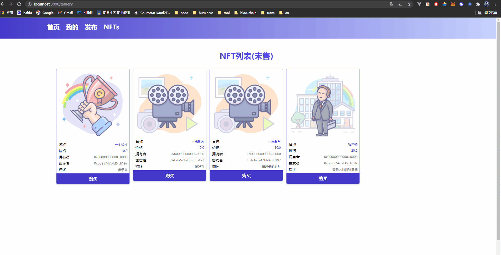

# A marketplace for NFTs based on eth and ipfs

[中文](README.md)

> This demo is for study only

### Libaries & Tools

- Wallet MetaMask
- Contracts [Solidity](https://docs.soliditylang.org/en/v0.8.11/)
- Ethereum development environment [Hardhat](https://hardhat.org/)
- IPFS stores [Pinata](https://www.pinata.cloud/)
- Frontend [Vue3](https://v3.vuejs.org/) + [Vite](https://vitejs.dev/) + [Tailwindcss](https://tailwindcss.com/) + [Typescript](https://www.typescriptlang.org/)
- Others
  - [web3Modal](https://github.com/Web3Modal/web3modal)
  - [ethers.js](https://github.com/ethers-io/ethers.js)

### Features

- Publish your own NFT product (currently limited to images only)
- Show all NFT assets for sale in the market on the list page
- Purchase NFT assets published by other users
- Display the NFT assets I have published and the NFT assets I have purchased on the "My" page


### Installation & Start
> you can use yarn or npm too
##### 1. install packages
```
pnpm install
```
##### 2. hardhat configuration
```
// hardhat.config.js -- Specific configuration item descriptions are available in the hardhat documentation
...
 defaultNetwork: "hardhat",
  networks: {
    hardhat: {
      chainId: 1342, //If this configuration item is filled in, the node corresponding to chainId is started based on the configuration item
    },
  },
  solidity: {
    version: "0.8.4",
    settings: {
      optimizer: {
        enabled: true,
        runs: 200,
      },
    },
  }
...
```
##### 3. run node by hardhat
```
pnpm hardhat node 
```
##### 4. compile & deploy contracts
```
pnpm hardhat  run --network localhost .\scripts\deploy.js
// you can find more details in the hardhat documentation
```
##### 5. start the front-end
```
pnpm run dev
```
##### 6. preview 
```
localhost:3000  //3000 is the default port
```

### 演示




### 参考
-   [polygon-ethereum-nextjs-marketplace](https://github.com/dabit3/polygon-ethereum-nextjs-marketplace) -  dabit3

